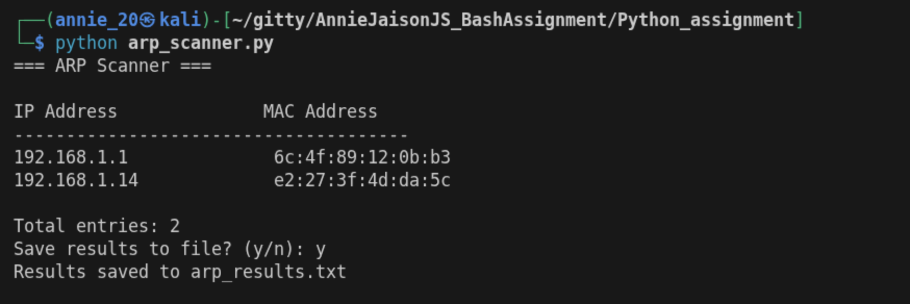
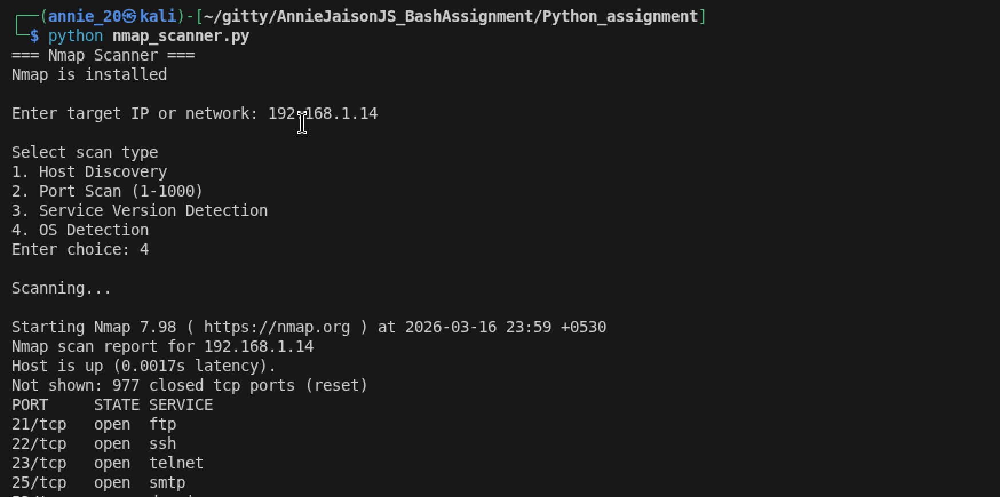
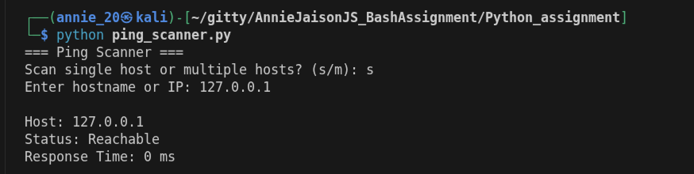

# Network Scanning Tools (Python)

This project automates network reconnaissance tools using Python.

## Tools Implemented

- Ping Scanner
- ARP Scanner
- Nmap Scanner

## Requirements

- Python 3.6+
- Nmap installed

## Install Nmap

Mac:
brew install nmap

Linux:
sudo apt install nmap

Windows:
Download from https://nmap.org/download.html

## Usage

### Ping Scanner
python ping_scanner.py

### ARP Scanner
python arp_scanner.py

### Nmap Scanner
python nmap_scanner.py

## Example Output

Screenshots are included in the screenshots folder.

## Ethical Notice

Only scan networks you own or have permission to test.

## Screenshots of outputs

